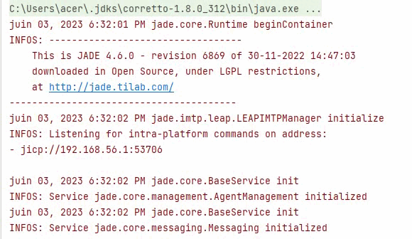
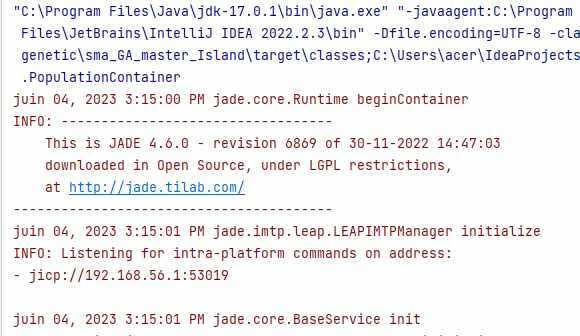

    <h1>Algorithme Génétique</h1>

        Les algorithmes génétiques sont des techniques d'optimisation inspirées par la théorie de l'évolution naturelle. Ils sont utilisés pour résoudre des problèmes complexes en générant itérativement des solutions candidates et en les améliorant au fil du temps.
    

<h3>Modèle Simple</h3>
    

        L'algorithme génétique dans sa forme la plus simple fonctionne en générant une population initiale de solutions, puis en les améliorant itérativement à l'aide d'opérateurs génétiques tels que la sélection, le croisement et la mutation. Les solutions les plus performantes sont sélectionnées pour former la prochaine génération, imitant ainsi le processus de sélection naturelle.
    

<h3>Modèle des Îles</h3>
    

        Dans le modèle des îles, plusieurs populations distinctes sont générées, chacune fonctionnant comme une "île" indépendante. De manière périodique, les individus les plus performants migrent entre les îles, permettant ainsi un échange d'information entre les populations. Ce modèle favorise l'exploration de l'espace de recherche et peut conduire à une convergence plus rapide vers une solution optimale.
    

